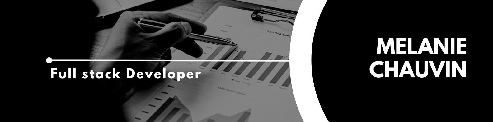

# Hey there! 

I'm Melanie, Full Stack developer from Lille, France 📍

🔭 I'm currently working to become a Full Stack Developer. After getting started on my own, I took a web development course that covered HTML, CSS, JavaScript, and PHP, and then continued on to a Java EE course that made me fall in love with the Java universe!

🌱 Now, I'm learning Angular because I'd like to be able to create beautiful projects by combining Angular and Java. I'm also about to start a training program to become a DevOps application developer. I'm excited to embark on this new adventure!

## 🛠 Skills

#### ⚡ Stuff I know 

#### 🤔 Stuff To Improve

<!--

## Goals

## 🔗 Links

https://dev.to/envoy_/150-badges-for-github-pnk
https://shields.io/

-->
