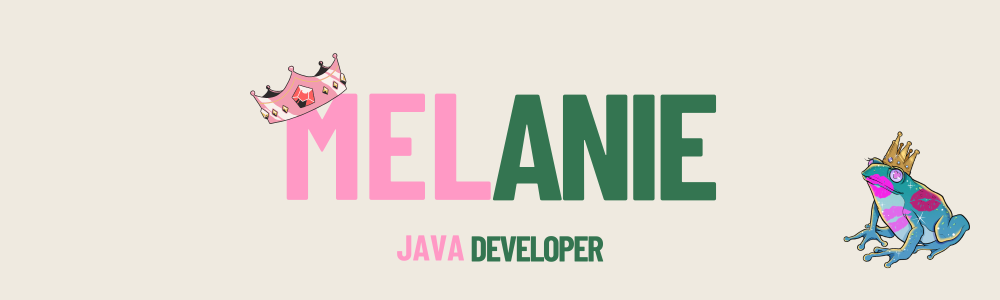

#  Hey there! 

I'm Melanie, Full Stack developer from Lille, France

🔭 I fell in love with the Java universe, so I decided to deepen my learning journey to become a better developer

🌱 I recently took my first steps in my professional life as a Java developer. At the same time, I'm pursuing a diploma in developer design!

💗 Outside of coding, I adore cooking and tastings, especially French cuisine, but I also love more exotic flavors!

#

##  🛠 Skills 

####  ⚡ Stuff I know 

####  🤔 Stuff To Improve 

#

## 👽

